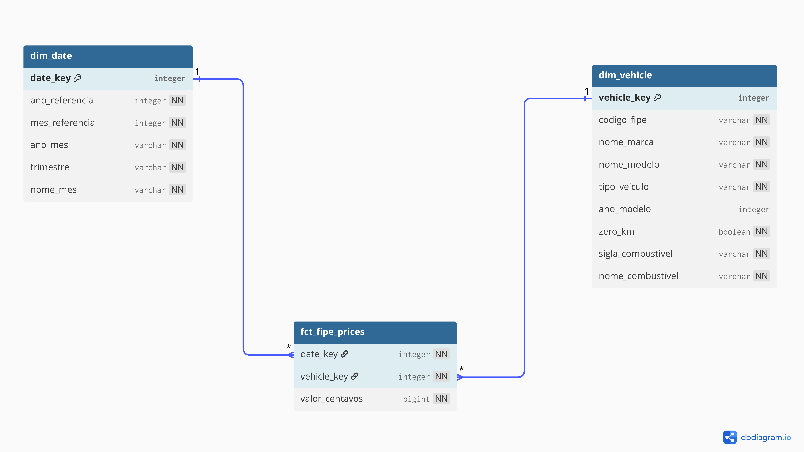
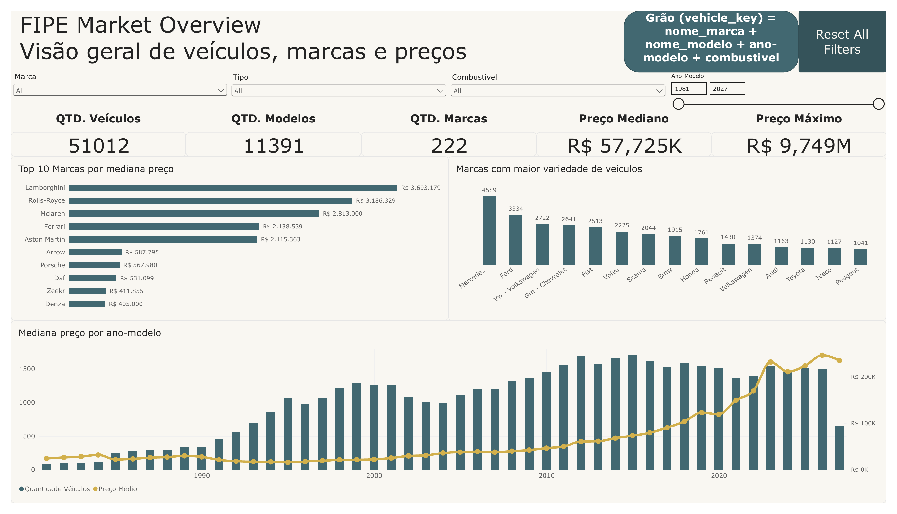
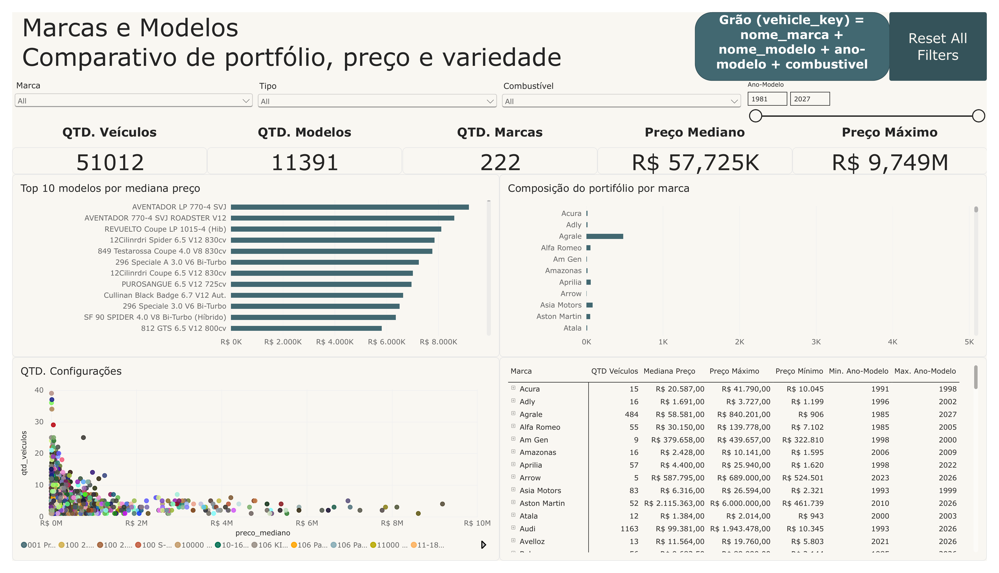
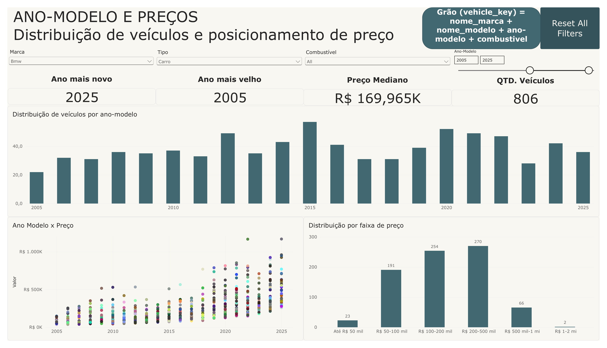

# Automotive Market Data Analysis

End-to-end Data Engineering and Analytics project built with Brazilian automotive market data, covering data profiling, data quality, Python transformation, dimensional modeling, DuckDB/SQL analytics and Power BI visualization.

The project transforms raw FIPE market data into a reproducible analytical pipeline and a Gold layer ready for Business Intelligence consumption.

---

## Project Overview

The objective of this project is to build a complete analytical workflow, from raw automotive pricing data to a dimensional model consumed by Power BI.

The project covers:

- data profiling and exploratory analysis;
- data quality rules and automated validation;
- Python transformations;
- Parquet storage;
- DuckDB analytical processing;
- modular SQL layers;
- dimensional modeling with a Star Schema;
- Gold layer generation;
- automated end-to-end orchestration;
- Power BI dashboard development.

---

## Architecture

```text
Raw Parquet
    |
    v
Python Pipeline
    |
    |-- Schema validation
    |-- Data quality validation
    |-- Standardization
    |-- Transformations
    |
    v
Processed Parquet
    |
    v
DuckDB + SQL
    |
    |-- Staging
    |-- Intermediate
    |-- Marts
    |
    v
Gold Parquet
    |
    |-- dim_date.parquet
    |-- dim_vehicle.parquet
    |-- fct_fipe_prices.parquet
    |
    v
Power BI
```

The project follows a structure inspired by the Medallion Architecture:

```text
Bronze  -> data/raw
Silver  -> data/processed
Gold    -> DuckDB marts + data/gold
```

---

## Repository Structure

```text
01_automotive_market_data_analysis/
├── data/
│   ├── raw/
│   ├── processed/
│   └── gold/
├── docs/
│   ├── data_dictionary.md
│   ├── data_quality_rules.md
│   ├── dimensional_model.dbml
│   ├── star_schema.pdf
│   ├── powerbi_dashboard.pdf
│   └── images/
│       ├── star_schema.png
│       ├── powerbi_overview.png
│       ├── powerbi_brand_model.png
│       └── powerbi_year_price.png
├── notebooks/
│   ├── 01_fipex_exploration.ipynb
│   └── 02_fipex_transformation.ipynb
├── sql/
│   ├── staging/
│   ├── intermediate/
│   ├── marts/
│   ├── analysis/
│   └── export/
├── src/
│   └── fipex/
│       ├── __init__.py
│       ├── config.py
│       ├── io.py
│       ├── transformations.py
│       ├── validation.py
│       └── pipeline.py
├── tests/
├── .gitignore
├── pyproject.toml
├── requirements.txt
└── README.md
```

---

## Data Source

The dataset represents FIPE automotive market prices and includes fields such as:

- reference year and month;
- vehicle type;
- FIPE code;
- manufacturer;
- model;
- model year;
- zero-kilometer indicator;
- fuel type;
- price.

Parquet is used as the main file format to preserve data types and provide efficient analytical storage.

---

## Data Profiling and Grain

The initial dataset was explored in:

```text
notebooks/01_fipex_exploration.ipynb
```

Profiling was used to identify:

- null patterns;
- cardinality;
- functional dependencies;
- duplicate behavior;
- categorical domains;
- monetary consistency;
- the correct dataset grain.

The validated snapshot grain is:

```text
codigo_fipe
+ ano_modelo
+ zero_km
+ sigla_combustivel
```

For historical observations, the reference period is also required.

---

## Data Quality

Data quality rules are documented in:

[View Data Quality Rules](docs/data_quality_rules.md)

The pipeline validates, among other rules:

- expected schema;
- mandatory fields;
- snapshot grain uniqueness;
- historical grain uniqueness;
- allowed vehicle types;
- valid reference months;
- fuel name/code consistency;
- FIPE code functional dependencies;
- positive monetary values;
- consistency between monetary representations;
- manufacturer name standardization.

An important semantic rule identified during profiling is:

```text
ano_modelo IS NULL <-> zero_km = TRUE
```

These null values are intentionally preserved instead of being replaced by an artificial model year.

---

## Python Transformation Layer

Reusable Python code is stored under:

```text
src/fipex/
```

Main responsibilities:

- `io.py`: dataset reading and writing;
- `transformations.py`: string cleanup, brand standardization, datatype normalization and column ordering;
- `validation.py`: data quality checks before and after transformation;
- `pipeline.py`: orchestration of the complete workflow.

---

## DuckDB and SQL Layer

DuckDB is used as the local analytical engine.

The SQL layer is divided into:

### Staging

Provides a stable SQL interface over the processed Parquet dataset.

### Intermediate

Prepares reusable business entities and natural keys before dimensional modeling.

### Marts

Materializes the analytical Star Schema used by downstream consumers.

### Analysis

Contains validation and exploratory analytical queries used to test the Gold layer before Power BI consumption.

---

## Dimensional Model

The analytical layer follows a Star Schema with two dimensions and one fact table.



[View Star Schema PDF](docs/star_schema.pdf)

The source DBML is available at:

[View dimensional_model.dbml](docs/dimensional_model.dbml)

### `dim_date`

Contains FIPE reference-period attributes:

```text
date_key
ano_referencia
mes_referencia
ano_mes
trimestre
nome_mes
```

`date_key` follows the `YYYYMM` format, for example `202609`.

### `dim_vehicle`

Represents a unique vehicle configuration:

```text
vehicle_key
codigo_fipe
nome_marca
nome_modelo
tipo_veiculo
ano_modelo
zero_km
sigla_combustivel
nome_combustivel
```

`vehicle_key` is a surrogate key. The natural key used to identify a vehicle configuration is:

```text
codigo_fipe
+ ano_modelo
+ zero_km
+ sigla_combustivel
```

### `fct_fipe_prices`

Stores FIPE price observations:

```text
date_key
vehicle_key
valor_centavos
```

The fact table grain is:

> One FIPE price for one vehicle configuration in one FIPE reference month.

Its logical primary key is therefore:

```text
date_key + vehicle_key
```

---

## Monetary Modeling

The canonical monetary field is:

```text
valor_centavos
```

Prices are stored as integer cents instead of localized formatted strings.

For example:

```text
R$ 85.568,00 -> 8556800
```

Formatting is handled in the presentation layer, avoiding localized strings in analytical calculations.

---

## Gold Layer

The SQL pipeline exports the dimensional model as Parquet files:

```text
data/gold/
├── dim_date.parquet
├── dim_vehicle.parquet
└── fct_fipe_prices.parquet
```

These files form the analytical interface consumed by Power BI.

---

## End-to-End Pipeline

The full workflow can be executed with a single command:

```bash
python -m fipex.pipeline
```

The orchestrator performs:

```text
Raw Data
    |
    v
Python validation
    |
    v
Python transformation
    |
    v
Processed Parquet
    |
    v
DuckDB Staging
    |
    v
Intermediate SQL
    |
    v
Dimensional Marts
    |
    v
Gold Parquet
```

This removes the need to execute notebooks or SQL scripts manually for normal pipeline runs.

---

## Automated Tests

The project includes automated tests with `pytest`.

Run them with:

```bash
pytest
```

The test suite covers core transformation and validation behavior.

---

## Analytical SQL

The Gold layer is validated using SQL queries covering subjects such as:

- price by brand;
- price by vehicle type;
- price by fuel;
- most expensive vehicles;
- price distribution.

These queries are stored under:

```text
sql/analysis/
```

---

# Power BI Dashboard

Power BI consumes the three Parquet files generated in the Gold layer.

The dashboard contains three analytical pages.

## 1. FIPE Market Overview

Overview of the complete market, including vehicle count, model count, brand count, median price, maximum price, top brands by median price, portfolio variety and price behavior by model year.



## 2. Brands and Models

Comparison of portfolio breadth, pricing and configuration variety across brands and models, with detailed brand-level metrics and model ranking.



## 3. Model Year and Prices

Analysis of vehicle distribution by model year, price positioning and price-band distribution. The dashboard supports interactive filtering by brand, vehicle type, fuel and model-year range.



### Full Dashboard

[View complete Power BI dashboard as PDF](docs/powerbi_dashboard.pdf)

---

## Technology Stack

| Area | Technology |
|---|---|
| Programming | Python |
| Data Manipulation | Pandas |
| Storage | Parquet |
| Analytical Database | DuckDB |
| Data Modeling | SQL |
| Testing | Pytest |
| Dimensional Modeling | Star Schema / DBML |
| Visualization | Power BI |
| Version Control | Git / GitHub |
| Development Environment | VS Code |

---

## Key Engineering Decisions

**Parquet instead of CSV**  
Preserves data types, provides compression and is better suited to analytical workloads.

**DuckDB as analytical engine**  
Provides lightweight SQL analytics directly over Parquet without requiring a database server.

**Modular SQL layers**  
Staging, intermediate and marts separate responsibilities and make transformations easier to maintain.

**Surrogate vehicle key**  
The dimensional model uses a technical key instead of embedding business meaning into a concatenated identifier.

**Preservation of semantic nulls**  
Missing `ano_modelo` values associated with zero-kilometer vehicles are preserved instead of artificially imputed.

**Canonical monetary representation**  
Prices remain stored as integer cents until the presentation layer.

**Gold layer decoupled from Power BI**  
Power BI consumes curated analytical outputs rather than implementing core data-transformation logic itself.

---

## Running the Project

### 1. Clone the repository

```bash
git clone <repository-url>
cd 01_automotive_market_data_analysis
```

### 2. Create the virtual environment

```bash
python -m venv .venv
```

### 3. Activate the environment on Windows

```bash
.venv\Scripts\activate
```

### 4. Install dependencies

```bash
pip install -r requirements.txt
```

### 5. Run automated tests

```bash
pytest
```

### 6. Run the complete pipeline

```bash
python -m fipex.pipeline
```

After successful execution, the analytical datasets are generated under:

```text
data/gold/
```

---

## Documentation

- [Data Dictionary](docs/data_dictionary.md)
- [Data Quality Rules](docs/data_quality_rules.md)
- [Dimensional Model - DBML](docs/dimensional_model.dbml)
- [Star Schema - PDF](docs/star_schema.pdf)
- [Power BI Dashboard - PDF](docs/powerbi_dashboard.pdf)

---

## Project Outcome

This project delivers a reproducible end-to-end analytical data pipeline, starting with raw automotive market data and ending with a dimensional model consumed by Power BI.

The project demonstrates practical application of:

```text
Data Profiling
Data Quality
Python ETL
Automated Validation
Parquet
DuckDB
SQL Transformation Layers
Dimensional Modeling
Star Schema
Surrogate Keys
Fact and Dimension Tables
Automated Testing
Pipeline Orchestration
Power BI
Git
Documentation
```
